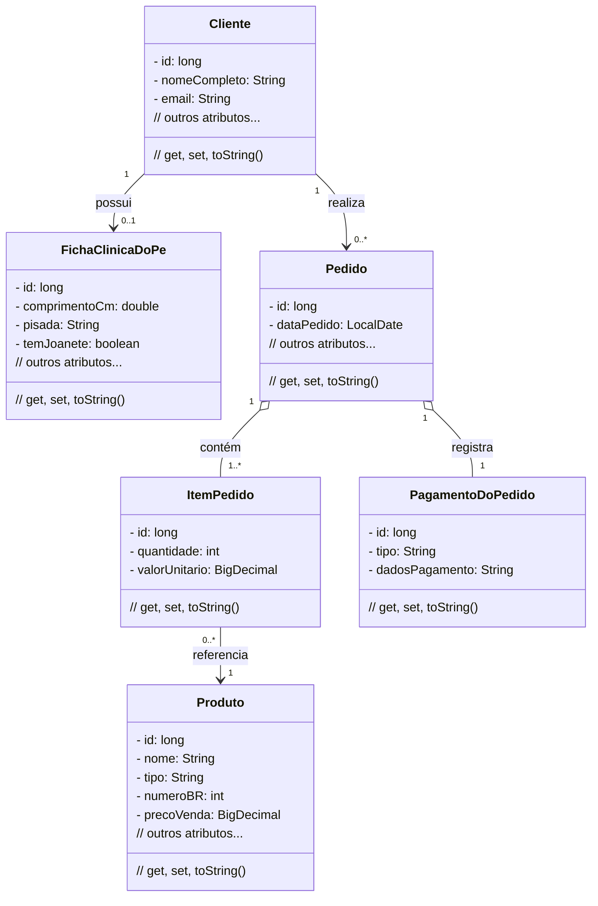

# Programação Web - 2026.2
**UFERSA - Centro Multidisciplinar de Angicos - CMA**
Bacharelado em Sistemas de Informação - **BSI** | Licenciatura em Computação e Informática - **LCI**
**Programação WEB by Xico**

---

# Sistema para loja de calçados - PéFrioShop

Sistema de informação para cadastro de clientes, produtos e pedidos de uma loja de calçados. Implementação incremental em 2 *milestones*. Em sistemas maiores teriam gestão de estoque, financeiro, funcionários e marketing - mas esse escopo é ***muito grande*** para 2 meses! O professor (que é uma mãe) simplificou.

*User Stories* expressam **requisitos funcionais** - *o que o sistema faz*, não como ele faz.

**Milestone 1** - até 14/11/2026 - US 1, 2, 3, 4.
**Milestone 2** - até 05/12/2026 - US à sua escolha.

---

## User Stories - Milestone 1

**US1 - Cliente (1,0 ponto)**
CRUD de cliente: id (autogerado), nome completo, gênero (Masculino / Feminino / Não Informado), rua, bairro, número, cidade, CEP, e-mail, telefone com DDD.

---

**US2 - Produto (1,5 ponto)**
CRUD de produto: id (autogerado), nome, marca, tipo (Tênis / Sandália / Bota / Sapatênis / Chinelo), gênero alvo (Masculino / Feminino / Unissex / Infantil), número BR, preço de compra, preço de venda, data de cadastro (automática).

---

**US3 - Ficha Clínica do Pé (0,5 ponto)**
Cada cliente tem no máximo uma ficha. CRUD: id (autogerado), comprimento do pé em cm, largura (Estreito / Normal / Largo), pisada (Pronada / Supinada / Neutra), número preferido BR, marca preferida, temperatura do pé (Frio / Normal / Quente), odor (Sem Odor / Leve / Forte), data da última visita ao podólogo, tem joanete (Sim / Não). Excluir cliente exclui a ficha em cascata.

---

**US4 - Pedido (2,0 pontos)**
Ao criar um pedido: listar produtos em ordem alfabética, selecionar cliente, itens e quantidades. Formas de pagamento: Dinheiro (guarda valor pago), Cartão de Crédito (guarda número do cartão), Pix (guarda a chave). Guardar data do pedido (automática) e valor unitário de cada item no momento da compra. Sem controle de estoque.

Ao listar: nome do cliente, data, itens com quantidades e valores unitários, valor total, imposto fixo de **18,5%**, total com imposto e forma de pagamento.

Excluir pedido não afeta clientes nem produtos. Atualizar pedido é um caos. CRUD completo.

---

## User Stories - Milestone 2

**US5 - Faturamento (1,0 ponto)**
Tabela com 12 linhas: faturamento mensal dos últimos 12 meses a partir de uma data informada. Rodapé: faturamento total, total de imposto (18,5%) e soma.

**US6 - Busca por nome (1,0 ponto)**
Buscar produtos pelo nome.

**US7 - Busca geral (2,0 pontos)**
Buscar produtos por qualquer campo.

**US8 - WhatsApp (0,5 ponto)**
Página de contato com botão para iniciar conversa no WhatsApp da loja.

**US9 - E-mail promocional (1,5 ponto)**
Enviar e-mail com 5% de desconto no tênis mais caro do último pedido, 30 dias após a compra.

**US10 - Preenchimento de CEP (1,5 ponto)**
No cadastro do cliente, preencher endereço automaticamente via serviço externo ao digitar o CEP.

**US11 - Aniversariantes (1,0 ponto)**
Tabela com nome completo e data de nascimento dos clientes aniversariantes em um mês informado.

**US12 - Foto do produto (2,0 pontos)**
Acrescentar foto ao CRUD de produto. Guardar o arquivo no banco de dados, não em pasta.

**US13 - Frete para Marte (2,0 pontos)**
Tabela com código, nome, preço e número BR de todos os produtos, do menor para o maior número BR. Para cada item: frete estimado de Angicos/RN até Marte (R$ 987.654,00 por par).

**US14 - Desconto (1,0 ponto)**
Tabela com nome, preço original e preço com desconto de **7,3%** dos 4 produtos mais novos, do maior para o menor preço com desconto.

**US15 - Produto por tipo (1,0 ponto)**
Tabela com contagem de produtos agrupados por tipo.

**US16 - Novatos (1,0 ponto)**
Tabela com id, nome completo e data de cadastro dos clientes cadastrados em um mês e ano informados.

---

## Diagrama de Classes

---

## Design System

Crie um arquivo `design-system.md` na pasta do projeto, baseado em **uma foto colorida de sua autoria** (foto deve estar na pasta do projeto). O arquivo deve conter:

1. A foto de referência (caminho relativo).
2. Paleta com no mínimo 3 cores extraídas da foto, considerando o círculo cromático.
3. Tipografia: fonte para títulos e fonte para corpo de texto.

O design system deve ser aplicado em todas as telas.

---

## O que entregar

Código-fonte no repositório da disciplina no GitHub. Pasta na raiz com o nome `peFrio_primeiroNomeSegundoNome`. O professor deve conseguir rodar com `./mvnw spring-boot:run` sem sua ajuda.

---

## Correção e avaliação

**Compilação** - Não compilou, nota mínima. Fim.

**Qualidade do código** - Indentação, nomes de classes/variáveis/métodos, organização de pacotes, ausência de loops desnecessários, gambiarras, código duplicado, números mágicos. Também: modularização, cascatas de *ifs*, tratamento de exceções, estilo homogêneo, MVC, Thymeleaf correto, princípios do JPA.

**Completude** - Teste manual de cada US por milestone. Parcial implementado recebe parcial. Exemplo: CRUD de cliente = 1,0 ponto / 4 funcionalidades = 0,25 cada. Funcionalidade faltando pode ser compensada com tecnologias extras (Bootstrap, CI/CD, Spring Native etc.) a critério do professor.

**Front-end** - Estética não é avaliada. Gerador de código liberado para o front.

**Correção oral** - Obrigatória no dia da entrega do milestone para nota completa.

**Atraso** - 1º dia: -4,0 pontos. Dias seguintes: -0,5/dia. Após 12 dias corridos: nota mínima.

---

## Dicas

1. Não resolva um problema que você ainda não tem.
2. Leia o [Manifesto Ágil](http://agilemanifesto.org/iso/ptbr/manifesto.html) e seus [12 princípios](https://robsoncamargo.com.br/blog/Manifesto-Agil-entenda-como-surgiu-e-conheca-os-12-principios).
3. Delete em cascata ao apagar cliente. Na vida real não se faz isso, mas facilita o trabalho. Não transforme o update em insert.
4. Valores calculáveis devem ser *calculados*. Não guarde no banco o que o código pode calcular.
5. O ideal para pedidos seria uma tabela de itens faturados com os valores do momento da compra - protege o histórico contra alterações futuras de produto.
6. Referência de domínio: [AlgaWorks - Domain Model](https://github.com/algaworks/curso-especialista-jpa/tree/master/diagrama-domain-model-especialista-jpa).

---

## Desafios desafiadores difíceis

Pode substituir a nota de uma US por um dos desafios a seguir:

1. Validar telefone com JS
2. Usar Tailwind CSS
3. Arquitetura REST
4. Outra *template engine* no lugar do Thymeleaf
5. SPA com React
6. App mobile com Flutter
7. Melhorar a UI do pedido com JS vanilla
8. PostgreSQL no lugar do H2
