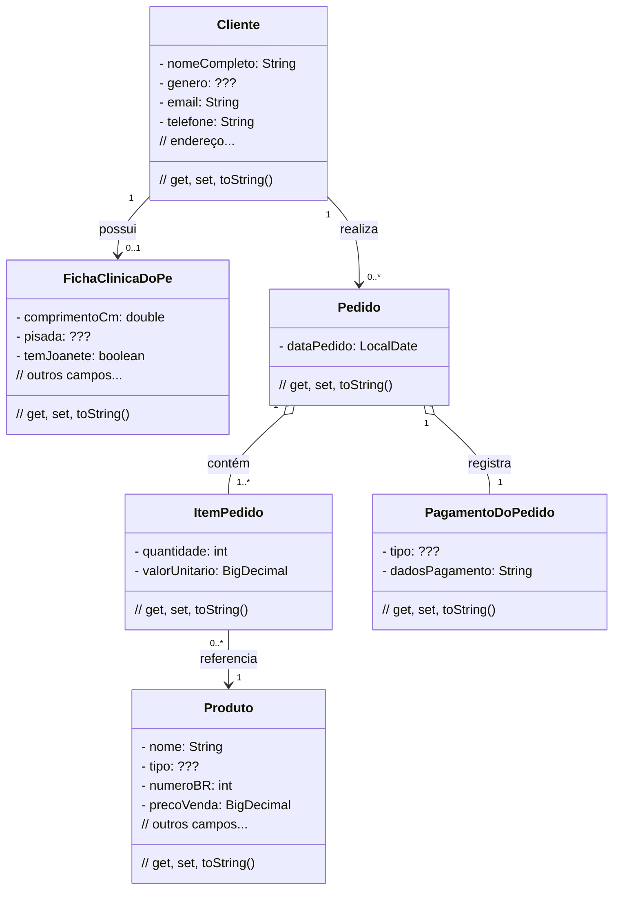

# Programação Web - 2026.2
**UFERSA - Centro Multidisciplinar de Angicos - CMA**
*Rua Gamaliel Martins Bezerra, n. 587, Alto da Alegria - Angicos/RN - CEP 59515-000*
Bacharelado em Sistemas de Informação - **BSI** | Licenciatura em Computação e Informática - **LCI**
**Programação WEB by Xico**

---

# Sistema para loja de calçados - PéFrioShop

Neste semestre, será projetado e desenvolvido um sistema de informação online para uma loja de calçados. A implementação será feita de forma incremental, com 2 *milestones* - em cada um novas funcionalidades são adicionadas. Em sistemas maiores teriam gestão de estoque, financeiro, funcionários e marketing. Mas esse escopo é ***muito grande*** para 2 meses! Então, o professor (que é uma mãe) simplificou o projeto.

*User Stories* são uma forma de expressar ***requisitos funcionais*** desejados para o sistema (*o que o sistema faz*, e **não** como ele faz). As *user stories* foram priorizadas pelo cliente na ordem a seguir.

**Milestone 1** - até 14/11/2026 - Implemente as *user stories* 1, 2, 3 e 4.
**Milestone 2** - até 05/12/2026 - Escolha e implemente outras *user stories*.

---

## User Stories - Milestone 1

**User Story 1 - Manter e exibir informações de um cliente (1,0 ponto)**

Adicione um novo cliente ao sistema. Manter as seguintes informações: id (autogerado), nome completo, gênero (Masculino / Feminino / Não Informado), rua, bairro, número, cidade, CEP, e-mail e telefone com DDD. Tudo num CRUD: *Create, Read, Update, Delete*.

---

**User Story 2 - Manter e exibir informações de produtos (1,5 ponto)**

Adicione um novo produto ao sistema. Manter as seguintes informações: id (autogerado), nome, marca, tipo (Tênis / Sandália / Bota / Sapatênis / Chinelo), gênero alvo (Masculino / Feminino / Unissex / Infantil), número BR, preço de compra, preço de venda e data de cadastro (automática). Tudo num CRUD: *Create, Read, Update, Delete*.

---

**User Story 3 - Manter e exibir a ficha clínica do pé do cliente (0,5 ponto)**

Após o cadastro do cliente, será possível cadastrar a sua **Ficha Clínica do Pé**. Cada cliente possui no máximo uma ficha. Manter as seguintes informações: id (autogerado), comprimento do pé em cm, largura (Estreito / Normal / Largo), tipo de pisada (Pronada / Supinada / Neutra), número preferido BR, marca preferida, temperatura habitual do pé (Frio / Normal / Quente), odor (Sem Odor / Leve / Forte), data da última visita ao podólogo e tem joanete (Sim / Não). Tudo num CRUD: *Create, Read, Update, Delete*. Ao excluir um cliente, a ficha é excluída em cascata.

---

**User Story 4 - Manter e exibir informação de pedidos (2,0 pontos)**

Ao realizar um pedido, todos os produtos cadastrados são exibidos em uma listagem, ordenados alfabeticamente pelo nome. O operador deve selecionar o cliente e os itens com a quantidade desejada.

Ao cadastrar o pedido, deve-se selecionar a forma de pagamento e preencher os dados pertinentes. As formas de pagamento disponíveis são: Dinheiro, Cartão de Crédito e Pix. Para Cartão de Crédito, guarde o número do cartão. Para Pix, guarde a chave utilizada. Para Dinheiro, guarde o valor pago.

Os seguintes dados devem ser guardados: data do pedido (automática) e valor unitário de cada item no momento da compra. Não há controle de estoque.

Ao listar os pedidos, será possível visualizar o nome do cliente, a data, os produtos com quantidades e valores unitários, o valor total, o imposto fixo de **18,5%**, o valor total com imposto e a forma de pagamento.

Ao excluir o pedido, o registro de produtos e de clientes não é afetado. Ao atualizar o pedido, é um caos. Tudo num CRUD: *Create, Read, Update, Delete*.

---

## User Stories - Milestone 2

**User Story 5 - Faturamento (1,0 ponto)**

Exiba, em uma tabela com 12 linhas, o faturamento de cada mês nos últimos 12 meses, a contar de uma data informada pelo usuário. Ao final, exiba o faturamento total, o total de imposto (18,5%) e a soma.

---

**User Story 6 - Buscar pelo nome dos produtos (1,0 ponto)**

Permita que o usuário do sistema busque os produtos pelo nome.

---

**User Story 7 - Buscar produtos (2,0 pontos)**

Permita que o usuário do sistema busque os produtos por qualquer campo.

---

**User Story 8 - Iniciar contato pelo WhatsApp (0,5 ponto)**

Faça uma página de contato com um botão para iniciar uma conversa no WhatsApp com o número da loja.

---

**User Story 9 - E-mail promocional (1,5 ponto)**

Faça uma funcionalidade que envie um e-mail para o cliente com 5% de desconto no tênis mais caro do último pedido, 30 dias após a compra.

---

**User Story 10 - Preenchimento do endereço (1,5 ponto)**

No cadastro do cliente, preencha o endereço automaticamente após digitar o CEP. Use um serviço externo.

---

**User Story 11 - Aniversariantes do mês (1,0 ponto)**

Exiba em tabela o nome completo e a data de nascimento dos clientes aniversariantes em um mês informado pelo usuário.

---

**User Story 12 - Foto do produto (2,0 pontos)**

Modifique o CRUD de produto, acrescentando a foto do produto. O arquivo da foto deve ser guardado no banco de dados, não numa pasta qualquer.

---

**User Story 13 - Frete para Marte (2,0 pontos)**

Exiba em tabela o código, o nome, o preço e o número BR de todos os produtos, ordenados do menor para o maior número BR. Para cada item, exiba o frete estimado de Angicos/RN até Marte (R$ 987.654,00 por par).

---

**User Story 14 - Desconto (1,0 ponto)**

Exiba em tabela o nome, o preço original e o preço com desconto de **7,3%** dos 4 produtos mais novos, ordenados do maior para o menor preço com desconto.

---

**User Story 15 - Produto por tipo (1,0 ponto)**

Exiba em tabela a contagem de produtos agrupados por tipo.

---

**User Story 16 - Novatos (1,0 ponto)**

Exiba em tabela os clientes cadastrados em um mês e ano informados pelo usuário: id, nome completo e data de cadastro.

---

## Diagrama de Classes

---

## Design System

O sistema PéFrioShop deve ter uma identidade visual própria, criada por você. Crie um arquivo `design-system.md` dentro da pasta do projeto. O design system deve ser baseado em **uma foto colorida de sua autoria** - a foto original deve estar na pasta do projeto.

O arquivo deve conter:

1. A foto de referência (com caminho relativo para o arquivo).
2. A paleta de cores extraída da foto, com no mínimo 3 cores, considerando o círculo cromático.
3. A tipografia escolhida: fonte para títulos e fonte para corpo de texto.

O design system deve ser aplicado em todas as telas do sistema.

---

## O que entregar

Entregue o código-fonte no repositório da disciplina no GitHub. Crie uma pasta na raiz do repositório com o nome `peFrio_primeiroNomeSegundoNome`. O professor deve conseguir rodar o projeto com `./mvnw spring-boot:run` sem sua ajuda.

---

## Correção e avaliação

**Compilação**

Não compilou, zero.

**Qualidade do código**

Serão avaliadas as variáveis e métodos, organização dos pacotes, ausência de loops desnecessários, gambiarras, código duplicado, números mágicos e nomes mal escolhidos. Também serão avaliados: modularização, cascatas de *ifs*, tratamento de exceções, estilo homogêneo, respeito ao padrão MVC, uso correto do Thymeleaf e dos princípios do JPA.

**Completude**

Para cada *milestone* haverá teste manual de cada *user story*. Funcionalidade parcialmente implementada recebe nota parcial. Exemplo: CRUD de cliente = 1,0 ponto / 4 funcionalidades = 0,25 por funcionalidade. Se uma funcionalidade do CRUD não for entregue, o professor poderá considerar pontos extras por uso de outras tecnologias (Bootstrap, CI/CD, Spring Native etc.).

**Front-end**

A estética não será avaliada. Se quiser, peça a um gerador de código para fazer o front-end - sem julgamentos.

**Atraso**

O primeiro dia de atraso resulta em desconto de 4,0 pontos na nota da unidade. Depois, 0,5 ponto por dia de atraso. Após 12 dias corridos de atraso, a nota é a mínima. Não tolero atrasos.

---

## Dicas e considerações

1. Não resolva um problema que você ainda não tem.
2. Leia o [Manifesto Ágil](http://agilemanifesto.org/iso/ptbr/manifesto.html) e seus [12 princípios](https://robsoncamargo.com.br/blog/Manifesto-Agil-entenda-como-surgiu-e-conheca-os-12-principios).
3. Ao apagar um cliente (CRUD - Delete), apague todos os registros em cascata. Na vida real isso não se faz, mas facilita o seu trabalho. Não transforme o update em insert.
4. Qualquer campo calculável deve ser *calculado*. Não guarde no banco valores que o código pode obter.
5. Na *user story* de pedido, o ideal seria uma tabela separada de itens faturados com os valores no momento da compra - isso preserva o histórico para os relatórios gerenciais sem que alterações futuras de produto baguncem tudo.
6. Consulte o diagrama de domínio de referência: [AlgaWorks - Domain Model](https://github.com/algaworks/curso-especialista-jpa/tree/master/diagrama-domain-model-especialista-jpa).

---

## Desafios desafiadores difíceis

Se não gostou das *user stories*, pode substituir a nota de alguma delas por um dos desafios a seguir:

1. Validar telefone com JS
2. Usar Tailwind CSS
3. Fazer o projeto em REST
4. Usar outra *template engine* no lugar do Thymeleaf
5. SPA com React
6. App mobile com Flutter
7. Melhorar a UI do pedido com JS vanilla
8. Usar PostgreSQL no lugar do H2
